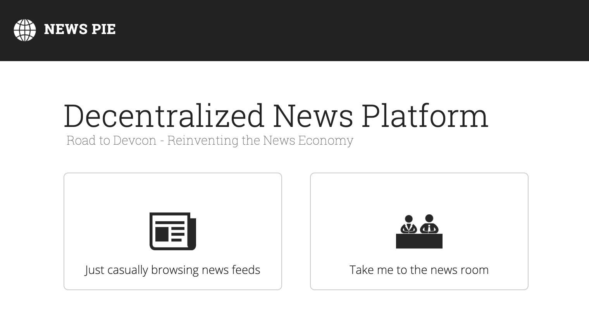

# News Pie
_Freshly baked news_

## Introducing News Pie

Much like Medium, News Pie brings together journalists who want to publish news articles and readers who want to read them.

## Purpose

We intend to make it as easy as possible for people to come together and form new journalism teams. This formation of teams can maximise the opportunity for journalism.

## System Overview

News Pie captures the traditional workflow of producing news (rarely would a single person be wholly responsible for a published news article) so that each member of the team owns their contribution and thus can earn their share of the pie!

Since we are using Ethereum smart contracts, information about the articles cannot be altered or censored, and ownership is undeniably certified.

At the consumer end of the spectrum, the news feed interface enables readers to discover articles created by teams, or browse stories matching relevant tags.

## Reasoning

Rarely would a single person be wholly responsible for a published news article, news creation involves sources of information, reporters, journalists, photojournalists and editors; amongst others. Ownership & attribution of news articles must recognise this collaborative work to function within future ecosystems.

This project is an engine for broader systems which have content monetisation baked in. Our research suggests that the greatest opportunities for the online news economy will come from enabling the producers of news to coordinate and collaborate in a mutually beneficial way, hence our belief in the [Mutualised Journalism](https://medium.com/@kelvinlockwood/the-regeneration-of-journalism-e44528335d42) thesis.

## Limitations

## Future Development

In the future we imagine news articles being divided into [Particles](http://nytlabs.com/blog/2015/10/20/particles/) so that journalists contribution is not just arbitrary metadata, physical parts of the article are attributed to their creators. This idea can be enabled by smart contracts which enforce rules and capture value. Different rules and different monetisation for different parts of the article gets pretty interesting and could open up a variety of opportunities.

Proudly built for: [Road to Dev Con: Consensys Labs Relay - Reinventing the Online News Economy](https://gitcoin.co/issue/ConsenSys/Road-To-Devcon-Relay/2/3482)

## Demo
https://djrosenbaum.github.io/news-pie/

Discover posts browsing news feeds or create your own news team and post stories.

# Local Development 

## Contract
1. clone the repo
2. cd into ./contracts/
3. nvm use
4. npm install
5. npm run dev
6. visit http://localhost:8080

## Client
1. clone the repo
2. cd into ./client/
3. nvm use
4. npm install
5. npm run dev
6. visit http://localhost:8081

### Medium Article
[The Regeneration of Journalism](https://medium.com/@kelvinlockwood/the-regeneration-of-journalism-e44528335d42) by [Kelvin Lockwood](https://github.com/kelvinlockwood)

### Thanks
We were inspired by the ideas of the following news sites and stories:

[Hacker News](https://news.ycombinator.com/)

[News Deserts](https://www.cjr.org/local_news/american-news-deserts-donuts-local.php)

[Future of News](https://www.bbc.co.uk/mediacentre/latestnews/2015/future-of-news)

### Contributors
See the list of [contributors](https://github.com/djrosenbaum/news-pie/contributors) who participated in writing this dapp.
