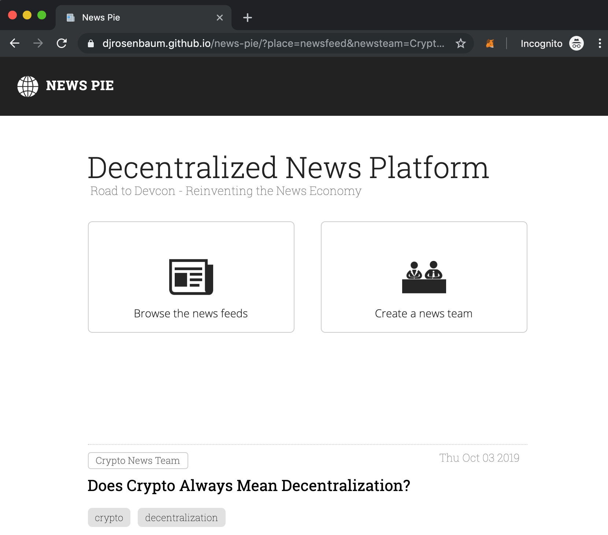

# Submission for Reinventing the Online News Economy

## Project Name
**News Pie** - *freshly baked news*

## Project Summary
Much like Medium, News Pie brings together journalists who want to publish news articles and readers who want to read them.

We intend to make it as easy as possible for people to come together and form new journalism teams. This formation of teams can maximise the opportunity for journalism.

News Pie captures the traditional workflow of producing news (rarely would a single person be wholly responsible for a published news article) so that each member of the team owns their contribution and thus can earn their share of the pie!

Since we are using Ethereum smart contracts, information about the articles cannot be altered or censored, and ownership is undeniably certified.

This project is an engine for broader systems which have content monetisation baked in. Our research suggests that the greatest opportunities for the online news economy will come from enabling the producers of news to coordinate and collaborate in a mutually beneficial way, hence our belief in the [Mutualised Journalism](https://medium.com/@kelvinlockwood/the-regeneration-of-journalism-e44528335d42) thesis.

At the consumer end of the spectrum, our news feed interface enables readers to discover articles created by teams, or browse stories matching relevant tags.

In the future we imagine news articles being divided into [Particles](http://nytlabs.com/blog/2015/10/20/particles/) so that journalists contribution is not just arbitrary metadata, physical parts of the article are attributed to their creators. This idea can be enabled by smart contracts which enforce rules and capture value. Different rules and different monetisation for different parts of the article gets pretty interesting and could open up a variety of opportunities.

We’ll also explore the possibilities of IPFS as a news article storage medium and [Kirby](https://github.com/joincivil/kirby-web3) for decentralised identity / web2-like user onboarding.

## Project Team
List each team member

* DJ Rosenbaum . dj.rosenbaum@gmail.com
* Kelvin Lockwood . kelvin.lockwood@gmail.com
* Tomasz Sikorski . tomaszsikorski92@gmail.com

OK to contact about future hackathons? **Yes**

## Project Advisor(s)

* Stephen Jefferson, CEO Bloom Labs
* Xiaohan Zhu, CEO Meter
* Regina Cai, Financial Engineer at UMA Protocol

## Link to Ancillary Material

- [**Pitch Deck**](https://docs.google.com/presentation/d/18MPs_s1sLnOx3JlxS83dFfKhgXUMXgbU1UrtCTqQ0RA/edit)
- [**Video Demo**](https://youtu.be/ynCh235qeVc)
- [**News Pie dApp Demo**](https://djrosenbaum.github.io/news-pie/)
- [**Open Source Git Repository**](https://github.com/djrosenbaum/news-pie)
- [**Article on Journalism**](https://medium.com/@kelvinlockwood/the-regeneration-of-journalism-e44528335d42)
- [**Newsletter**](https://mutualtimes.substack.com/)
- [**Stakeholder Map**](news-pie_stakeholder-map.pdf)
- [**Feedback and testimonials gathered during user research**](news-pie-research-story.pdf)

## Project Launch Page

[News Pie Demo](https://djrosenbaum.github.io/news-pie/)